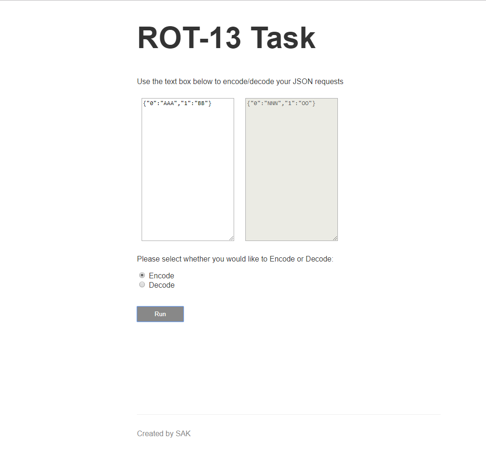
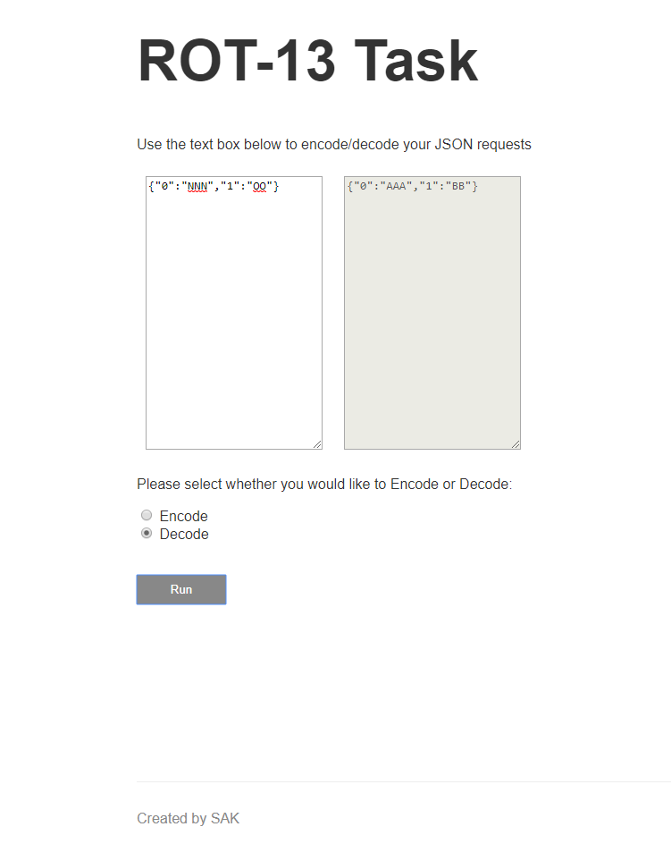

# ROT13 Task in typescript with custom ROT13 module/library

This project encodes/decodes the text fields in an HTTP request body (for POST method). To run the project, use: npm run dev in the terminal.

Examples:

<strong>Encoding: To encode an incoming request body, send the below request via POSTMAN </strong>

Route: localhost:3000/encode

Request Body JSON: 

{  
	"input1": "ABCDEFG",  
	"input2": "BCDEFGH"  
}

Response will be:

{ 
    "NOPQRST",  
    "OPQRSTU"  
}

<strong>Decoding: To decode an incoming request body, send the below request via POSTMAN</strong>

Route: localhost:3000/decode

Request Body JSON: 

{  
	"input1": "NOPQRST",  
	"input2": "OPQRSTU"  
}

Response will be:

{  
    "ABCDEFG",  
    "BCDEFGH"  
}

<strong>UI Screenshots</strong>

This project implements typescript as the original ROT-13 project has been converted from plain JavaScript into Typescript. Steps are as follows:

1. Create a tsconfig.json file and configure it. Include the source and destination folders.
2. Put all project files in a src folder, this will be the input folder to be compiled later.
3. In the terminal, run tsc command to compile the src folder's .js files into typescript. The output will be placed in the destination folder.
4. Place any missing files from src into the destination folder as tsc only copies .js files.
5. Change the destination folder's .js files to .ts by renaming them. Now you will see highlighted errors/warnings etc from typescript.
6. Fix all errors/warnings etc. Sometimes you may have to install type definitions for the various libraries being used e.g. npm i @types/express
7. Check all the paths in your destination folder, change package.json so that main script from destination folder is run.
8. Nodemon/Node will only run .js files and not .ts files, so if you don't have .js files in the destination folder after renaming, you can run tsc in terminal to place them there again.