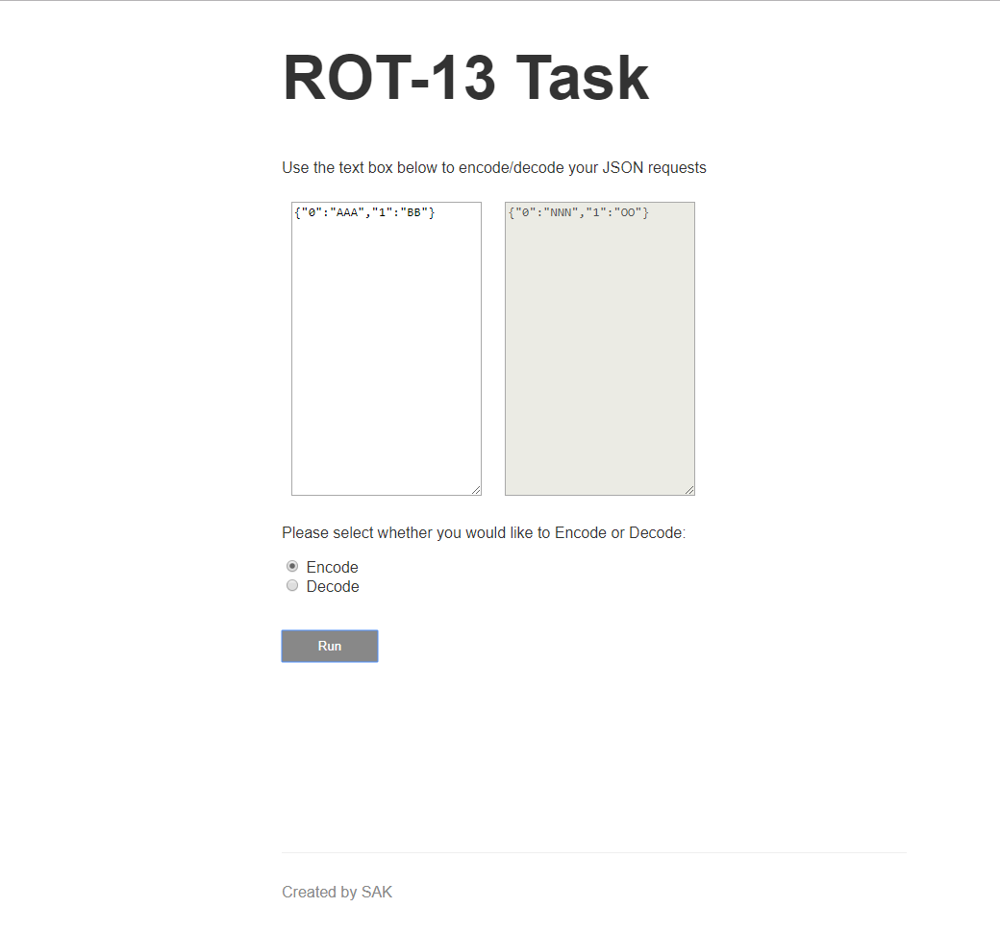
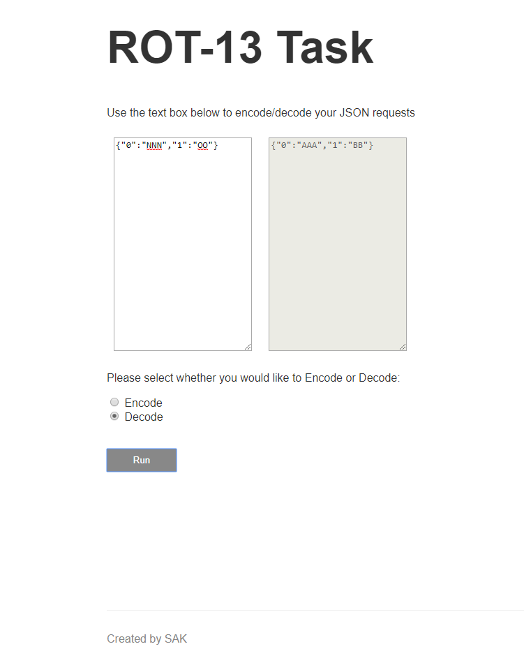

# ROT13 Task in typescript

This project encodes/decodes the text fields in an HTTP request body (for POST method). To run the project, use: npm run dev in the terminal.

Examples:

<strong>Encoding: To encode an incoming request body, send the below request via POSTMAN </strong>

Route: localhost:3000/encode

Request Body JSON: 

{  
	"input1": "ABCDEFG",  
	"input2": "BCDEFGH"  
}

Response will be:

[ 
    "NOPQRST",  
    "OPQRSTU"  
]

<strong>Decoding: To decode an incoming request body, send the below request via POSTMAN</strong>

Route: localhost:3000/decode

Request Body JSON: 

{  
	"input1": "NOPQRST",  
	"input2": "OPQRSTU"  
}

Response will be:

[  
    "ABCDEFG",  
    "BCDEFGH"  
]

<strong>UI Screenshots</strong>

